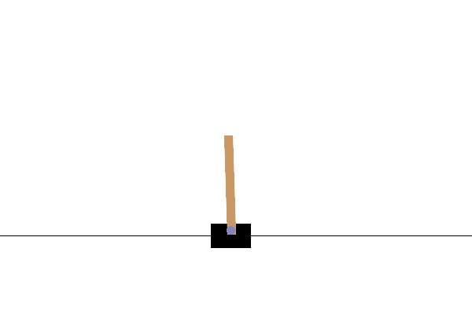

# Cartpole SARSA

A SARSA (State, Action, Reward, State Prime, Reward Prime) implementation that
learns to balance a pole on a cart using a $Q$ ("quality") table.



### TL;DR Running the Program

The application runs on Ubuntu 24.04 with Docker Compose.

```
docker compose up --build
```

It takes a few minutes for the training to complete, and then the program
renders the results to animated GIF files in the `data/` directory.

### Overview

The [Cartpole environment](https://gymnasium.farama.org/environments/classic_control/cart_pole/)
is part of [Gynmasium](https://gymnasium.farama.org/), which is a maintained
fork of OpenAI Gym. It has a four-dimensional observation space ("state")—cart
position, cart velocity, pole angle, and pole angular velocity—and two possible
actions—left and right.

The goal is to move the cart left and right such that the pole remains balanced.
A reward of +1 is given for each timestep until the cart moves off the screen or
the pole falls to a certain angle.

Each part of the observation state is a continuous number; cart position, for
example, falls in the range `[-4.8, 4.8]`. The SARSA algorithm, described in
more detail below, is implemented with a lookup table called $Q$ (for
"quality"). In this case, $Q$ is a four-dimensional array, where each index is a
state, and the associated value is the predicted/learned reward for taking an
action, like so:

```
q[cart_pos][cart_vel][pole_ang][pole_ang_vel] == [left_reward, right_reward]
```

Or, written more succinctly:

```
# s is an observed state.
q[s] == [left_reward, right_reward]
```

This of course means that each part of an observation's state must be a discrete
number so that it can be used as an index into the $Q$ table. In this particular
implementation, each continuous observation value is converted to a discrete
number.

### Algorithm

Five variables are needed for the SARSA algorithm:

* $S$: An environment state (a.k.a. an observation), as described above in the
[overview](#overview) section.
* $A$: The action that was applied at state $S$, bringing the environment to a
new state $S'$.
* $R$: The reward that was attained for taking action $A$ and thereby traversing
from state $S$ to $S'$. This is +1 if the pole is upright and the cart is
onscreen, or 0 on failure.
* $S'$: The new state of the environment, after applying action $A$ from state
$S$.
* $A'$: The action that will be applied from state $S'$ in the next timestep.

Given a state, an action is chosen using a linear epsilon-greedy function. When
training begins, $\epsilon$ (epsilon) starts at 1; that is, actions are 100%
random. Over time, $\epsilon$ decays linearly down to 0, and the $Q$ table is
referenced more and more.

$$
a \gets
\begin{cases}
\in_RA, & \text{with probabilty}\ 1 - \epsilon \\
argmax\ Q(s), & \text{with probability}\ \epsilon
\end{cases}
$$

Where $a$ is the action to take from state $s$, and $\in_RA$ is a random action
(here $A$ is the set of all possible actions).

After an action is taken, the $Q$ values associated with the State-Action tuple
are updated in the direction of the error. The error is the difference between
the actual reward $R$ and the predicted/expected reward (the predicted reward
for the current state-action less all future predicted rewards):

$$
\begin{aligned}
r_p &\gets Q(s,a) - Q(s',a') \\
e &\gets r_a - r_p \\
  &= r_a - [Q(s,a) - Q(s',a')] \\
  &= r_a + Q(s',a') - Q(s,a)
\end{aligned}
$$

Where $r_p$ is the predicted reward, $r_a$ is the actual reward, and $e$ is the
error.

Future rewards can be discounted to make the algorithm more myopic, i.e. to
prefer current rewards over future rewards. This is controlled by a "discount
factor", which is conventionally $\gamma$ (gamma).

Lastly, a "learning rate" variable, conventionally $\alpha$ (alpha), is used to
move the $Q$ values for the $S$-$A$ tuple slightly in the direction of the
error, i.e. to "slowly learn" the value of taking an action from a state.

The update algorithm is thus:

$$Q(s,a) \gets Q(s,a) + \alpha[r + \gamma Q(s',a') - Q(s,a)]$$

Wikipedia has a great
[article on SARSA](https://en.wikipedia.org/wiki/State%E2%80%93action%E2%80%93reward%E2%80%93state%E2%80%93action).
Note that the algorithm in that article is the same as above, just slightly
rearranged for math etiquette:

$$
\begin{aligned}
Q(s,a) &\gets (1 - \alpha)Q(s,a) + \alpha[r + \gamma Q(s',a')] \\
       &= Q(s,a) - \alpha Q(s,a) + \alpha[r + \gamma Q(s',a')] \\
       &= Q(s,a) + \alpha[r + \gamma Q(s',a') - Q(s,a)]
\end{aligned}
$$

### References

[David Silver's Course](https://youtube.com/playlist?list=PLzuuYNsE1EZAXYR4FJ75jcJseBmo4KQ9-&si=GbNdD73nvvHjIgGn)
on reinforcement learning has a great lecture on SARSA.

* [Reinforcement Learning: An Introduction (Chapter 6.4)](http://incompleteideas.net/book/ebook/node64.html)
* [RL Course by David Silver](https://youtube.com/playlist?list=PLzuuYNsE1EZAXYR4FJ75jcJseBmo4KQ9-&si=GbNdD73nvvHjIgGn)
* [State-action-reward-state-action (Wikipedia)](https://en.wikipedia.org/wiki/State%E2%80%93action%E2%80%93reward%E2%80%93state%E2%80%93action)
